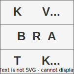

<p align="center">
  <a href="" rel="noopener">
 </a>
</p>

<h3 align="center">Kvadratka</h3>

<div align="center">

[]()
[](https://github.com/AndreyBritvin/kvadratka/issues)
[](https://github.com/AndreyBritvin/kvadratka/pulls)
[](/LICENSE)

</div>

---

<p align="center"> Решение квадратных уравнений.
    <br>
</p>

## 📝 Table of Contents

- [About](#about)
- [Getting Started](#getting_started)
- [Deployment](#deployment)
- [Usage](#usage)
- [Built Using](#built_using)
- [TODO](../TODO.md)
- [Contributing](../CONTRIBUTING.md)
- [Authors](#authors)
- [Acknowledgments](#acknowledgement)

## 🧐 About <a name = "about"></a>

Эта программа решает квадратные уравнения вида ax^2+bx+c=0 используя коэффициенты a, b, c.

## 🏁 Getting Started <a name = "getting_started"></a>

### Installing

Склонируйте репозиторий и запустите Makefile (подробнее в [Deployment](#Deployment)

## 🔧 Running the tests <a name = "tests"></a>


Создайте файл file.txt где будут находиться данные об unit тестах (не более 20 тестов) для проверки функции квадратного уравнения или воспользуйтесь готовым файлом test_data/unit_test_data.txt

Запустить тест:
```
a.out -t file.txt
```


## 🎈 Usage <a name="usage"></a>

Чтобы решить квадратное уравнение введите

```
a.out -s
```

И следуйте инструкциям по вводу коэффициентов

## 🚀 Deployment <a name = "deployment"></a>

Убедитесь, что Makefile соответствует настройкам вашей системы

Введите
```
make
```
Для создания исполняемого файла a.out (или a.exe для Windows 👎)

### Doxygen setting
Для визуализации структуры проекта установите и запустите Doxygen:
```
sudo apt-get install doxygen
```
Перейдите в папку проекта и введите
```
doxygen Doxyfile
```

## ✍️ Authors <a name = "authors"></a>

- [@AndreyBritvin](https://github.com/AndreyBritvin) - основная работа

## 🎉 Acknowledgements <a name = "acknowledgement"></a>

- Спасибо [Деду](https://github.com/ded32) и ментору за летку
